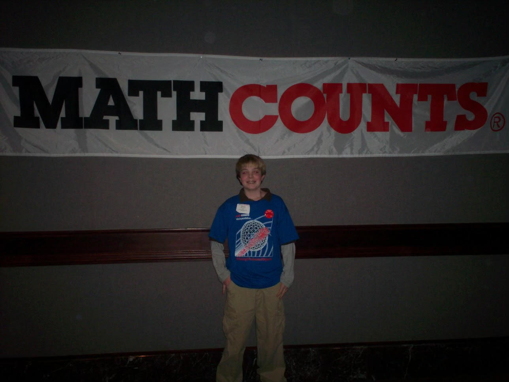

# Insights
## A Mathematician
{ width=80% }

::: notes
* Mathcounts in middle school
* Undergraduate in applied mathematics at BYU
:::

## An Engineer

::: notes
* Trebuchet project in high school
* Graduate degree in EE from BYU
:::

## A Computer Scientist
{ width=80% }

::: notes
* IBM model M keeb
* Mario
* Working on Masters in CS from GT
:::

# Zettelkasten

## "zettel kasten"

## "slip box"

## "note box"

##
{ width=70% }

[Creative commons licensed image](https://en.wikipedia.org/wiki/Zettelkasten#/media/File:Zettelkasten_(514941699))

# History

## Niklas Luhmann

## Incredibly Prolific

::: notes
* over 400 Publications
* over 70 books
* 90,000 index cards
:::

# Problems with Note Taking

## Hierarchical Knowledge

::: notes
* expertise before learning
* parent or child knowledge
  - e.g. chapters vs sections
:::

## Inflexible

::: notes
* resistant to change and reordering
* restructure with new discoveries
* "outdated knowledge"
:::

## I am ~~bad~~ terrible at taking notes

::: notes
* High school
* undergrad
* graduate school
:::

# Insights From Engineering

## Procedure

::: notes
* Engineers love procedure
* Sequence of steps for success
* Two main procedures
  - creation
  - analysis
:::

## Creation

1. Have an idea
2. Record the idea
3. Link to other ideas
4. Add tags

::: notes
* Notes should be uniquely identified and preferrably not by title
:::

## Analysis

1. Read your notes
2. Look for connections
3. Goto Creation

## Structured Creativity

::: notes
* don't get overwhelmed by categorization decisions
* when writing, don't have to worry about the "big picture"
:::

# Computer Science

## Data Structure

{ width=60% }

::: notes
* What kind of data structure is this mess?
:::

## Directed Graph

{ width=80% }

::: notes
* With metadata
:::

## Graph-Based Algorithms

* [So Many Algos](https://www.geeksforgeeks.org/graph-data-structure-and-algorithms/)

::: notes
* Inference on yourself
* Get an outside view into your own brain
:::

## Page Rank

$$PR(n_i) = \frac{1 - d}{N} + d \sum_{n_j \in M(n_i)} \frac{PR(n_j)}{L(n_j)}$$

::: notes
* Sergey Brinn and Larry Page
  - Sergey got short end of the stick
* Rank your ideas!
* Turn your brain into a big eigen value problem!
* $d$ probability you follow a link
* $N$ total number of links
* $PR(n_i)$ is page rank value of node $i$
:::

## Dijkstra Shortest Path

$$d(n_i, n_j)$$

::: notes
* calculate distance between any two nodes in the graph (weakly connected)
* What can this tell us about similarity of ideas?
:::

# Mathematics

## Metric Space

$$(X,d)$$
$$d: X \times X \to \mathbb{R}$$

::: notes
$X$ is a set
$d$ is a distance function
:::

## Metric Space Properties

$$d(a,b) = d(b,a)$$
$$d(a,b) = 0 \iff a = b$$
$$d(a,b) + d(a,c) \geq d(a,c)$$

::: notes
* The key is that you know this already
* All your conceptions about distance
:::

## Graphs

::: notes
* Is this metric? Nope.
:::

## Metric for Graphs

$$\bar{d}(n_i, n_j) =
\begin{cases}
\text{dijkstra distance}: \text{ path exists from } n_i \to n_j \\
\infty: \text{ otherwise}
\end{cases}
$$
$$d(n_i, n_j) = \min \left(\bar{d}(n_i, n_j), \bar{d}(n_j, n_i)\right)$$

::: notes
* Don't get intimidated, this just means we can go forward or backwards
* This is just me being "careful" (read anal) as a mathematician
:::

## Topology
$$(X, \mathcal{T})$$

::: notes
* $X$ is a set
* $\mathcal{T}$ is a set of subsets
* Sometimes we call this pair a "topological space"
:::

## Topology Properties
$$X,\varnothing \in \mathcal{T}$$
$$\bigcup_{i \in I} U_i \in \mathcal{T}$$
$$U_1 \cap U_2 \in \mathcal{T}$$

::: notes
* Whole set, and empty set
* Arbitrary unions
* Finite intersections
:::

## Is _Topology_ the same as **Topology**?
* Yes
* Every Metric Space is a Topological Space

## Metric Topology for Graphs

::: notes
* Draw on this graph, show union and intersection
:::

## Tag Topology

::: notes
* Draw on this graph to show some example tags
* We can actually think of this as another tag graph!
:::

## Zettelkasten

* Tag Graph vs. Link Graph

::: notes
* Topology measures connectedness and closeness
* What does connectedness mean in link graph vs tag graph
:::

# Demo

## My Website
[devonmorris.dev](https://devonmorris.dev)

## Neuron
[Neuron Github](https://github.com/srid/neuron)

## Neovim
* Do It Live!!!

# Philosophy

## Mirror of the mind

## Partner in Communication
> That slip boxes can be recommended as partners of communication is first of
> all due to a simple problem about technical and economic theoretical
> research. It is impossible to think without writing; at least it is
> impossible in any sophisticated or networked fashion.

## Partner in Communication
> One of the most basic presuppositions of communication is that the partners
> can mutually surprise each other. Only in the way can information be produced
> in the respective other. Information is an intra-systematic event. It results
> when one compares one message or entry with regard to other possibilities.
